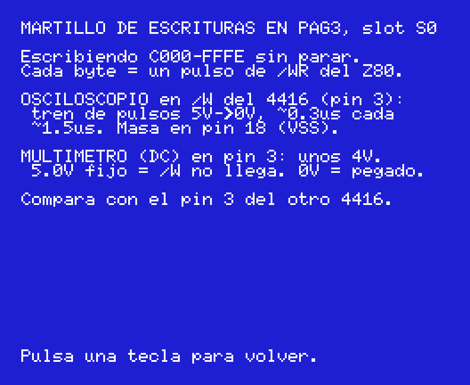

# Goa'uld Doctor — diagnóstico de placas MSX desde el zócalo del Z80

🇬🇧 [English version](README.md)


Firmware especial para el **MSX Goa'uld** (Tang Nano 20K en el zócalo del Z80) que,
en vez de arrancar el MSX, **prueba la placa** desde dentro: BIOS, RAM, mapper,
VDP, VRAM, sprites, PPI, PSG, RTC y teclado. El resultado sale por el **HDMI del
Goa'uld**, así que la placa puede tener la BIOS, la RAM y el vídeo muertos y aun
así ves qué falla. Es un comprobador en circuito al estilo Fluke 9010A, hecho con
lo que ya tienes: el Goa'uld.

Sirve para **cualquier MSX1 o MSX2**: mapea y prueba todos los slots y subslots,
TMS o V9938/V9958 con 16/64/128 KB de VRAM, mapper de memoria y RTC.

Derivado de [jabadiagm/MSXgoauldSD_tn20k](https://github.com/jabadiagm/MSXgoauldSD_tn20k)
(el core MSX2+ del Goa'uld: T80, V9958 de HRA!, SDRAM, cargador de flash). Licencia GPLv3.

## Qué necesitas

- Un Goa'uld (Tang Nano 20K) pinchado en el zócalo del Z80 de la placa a reparar y un monitor HDMI.
- Grabar en la flash del Tang Nano, con el programador de Gowin, como en el Goa'uld normal:
  - `GoauldDoctor_v1.1.fs` → **0x000000** (o cargarlo en SRAM para una sesión).
  - El **pack de BIOS del Goa'uld v1.2** → **0x200000** (el mismo que ya usa tu Goa'uld;
    contiene BIOS con copyright y no se distribuye aquí).
- La placa tiene que alimentar el Goa'uld: si el Goa'uld se reinicia, mide los 5 V que le llegan.

No hace falta tarjeta SD, ni teclado USB, ni WiFi: esta build los quita a propósito.

## Qué sale en pantalla

### 1. Arranque

Logo MSX2+ del Goa'uld (como siempre) y enseguida una línea de progreso:


Tarda entre 10 s (MSX1) y ~40 s (MSX2 con 128 KB de VRAM y mapper). Mientras
prueba el VDP, la salida de vídeo **de la placa** enseña barras de color, texto
y sprites: si tienes su monitor conectado, ahí ves si la etapa de vídeo funciona.


### 2. El resumen

Ejemplo: un MSX1 (Sony HB-10) con todo bien.


Cada fila termina en **OK**, **MAL** o **n/d** (no aplica). Se lee de arriba abajo:
la primera fila en MAL suele ser la avería.

| Fila | Qué prueba | Qué pone |
|---|---|---|
| **RELOJ** | El reloj de 3,58 MHz que la placa da al Z80 (viene del VDP). | `3579.6k placa` = kHz medidos y origen. `INT!` = no llega reloj y el Goa'uld usa el suyo. `RST H/0` = nivel de /RESET y flancos desde el encendido. `WT H` = nivel de /WAIT (`/WAIT pegado` si lo suelta él). |
| **BIOS** | Lee la ROM de la placa (0000-7FFF) por el bus. | Los dos primeros bytes (`F3C3` = DI;JP), los bytes de identificación 002B-2D, el CRC32 y el nombre de la máquina si lo reconoce (95 ROMs MSX1/MSX2). `BIOS muda` si todo es FF. Si alguna línea de datos no se movió nunca, lo dice abajo en las pistas. |
| **MAPA** | Cada slot (y subslot si está expandido) por página. | `ROM` lee algo, `RAM` se puede escribir, `---` vacío, `own` la página donde vive el propio Doctor (solo en emulador). |
| **RAM** | Cada bloque RAM del mapa: March C-, bits andantes, direcciones, retención. | `S0 p3 16383 b OK`, o `FALLO @C123 e=00 g=01 f2` = dirección, esperado, leído y fase. Páginas iguales de un slot se agrupan: `p0-p2 48 KB`. |
| **MAPPER** | Mapper de memoria (puertos FC-FF) en los slots con RAM en pág. 2. | `8 seg 128K regs ok`, `sin mapper (RAM plana)`, o `seg 5 @9234 e=92 g=00` / `FD s2 @4000 …` si un segmento o un registro falla. |
| **VDP** | El chip de vídeo de la placa. | Tipo (`TMS`, `9938`, `9958`), registro de estado, frames por segundo, frecuencia de /INT con las interrupciones activadas. `VDP mudo` si no contesta. |
| **VRAM** | Toda la VRAM (16/64/128 KB) por los puertos 98/99. | `16K sin fallos`, o `1 fallos bits:5A / 1o @b5:0234 e=5A g=00 f6`: cuántos, qué bits, primer fallo (banco:dirección), fase. |
| **CMD** | Solo V9938/V9958: el motor de comandos (HMMV + HMMM). | `verificados` o `motor colgado`. |
| **SPRITE** | Colisión de sprites y bandera de 5º sprite, renderizando de verdad. | `colis:OK 5o=4`. |
| **PPI** | El 8255 de la placa. | Lo escrito y lo releído en A8 y AA, y lo que lee A9 (columna de teclado). |
| **PSG** | El AY-3-8910 de la placa. | `R0-R13 releen bien` o la lista de registros que fallan. |
| **RTC** | Solo MSX2: el RP5C01 (B4/B5). | `RP5C01 seg 32>34 RAM26 ok` (los segundos avanzan y sus 26 nibbles de RAM guardan), `PARADO: 32kHz/pila`, `no responde`. En MSX1: `no hay (placa MSX1)`. |

Debajo, las **pistas** (líneas `>`): lo que el Doctor deduce del conjunto.

```
> Sin reloj Z80: VDP, cristal 10.7MHz o 5V
> BIOS muda y VDP mudo: 5V, reset, /SLTSL
> BUS DATOS pegado (todo falla por eso): D1=1
> VRAM: nibble D0-D3 64-128K
> pag3 lee y no escribe: VCC/GND RAM, /W
> RAM y VRAM fallan: alimentacion DRAM?
> Teclado placa: pegada f/b 8/0
> Teclado placa: 26 cambios/s, ignorado
```

Ejemplo: un MSX1 cuya RAM lee pero no acepta escrituras:


Ejemplo de MSX2 (Philips NMS 8250, en openMSX):


### 3. Teclas

El Doctor lee el teclado de la placa directamente (matriz por el PPI) y solo
reacciona a una tecla que **pasa de suelta a pulsada** tras medio segundo de
calma: una membrana pegada o con falsos contactos no puede moverlo, y sale en las pistas.

| Tecla | Pantalla |
|---|---|
| **SPC** | Repite todo el diagnóstico. |
| **V** | Patrones en la salida de vídeo **de la placa**: `1` cuadro del Doctor (texto+barras), `2` barras de color a pantalla completa, `3` blanco pleno, `4` negro (solo sincronismo); `ESC` vuelve y el patrón se queda puesto. Para la etapa de vídeo y el conector AV/RF (COMVID del TMS, pin 36: ~1 Vpp). |
| **W** | Martillo de escrituras: escribe sin parar en la página 3 de la placa para poder mirar con el osciloscopio o el multímetro /W, /RAS y /CAS de las RAM con una señal continua. Multímetro en DC sobre /W: unos 4 V si pulsa, 5,0 V fijos = /W no llega, 0 V = pegado. Cualquier tecla vuelve. |
| **X** | Página 3 (C000 y E000) en crudo: dos lecturas seguidas y una tercera tras escribir 00..FF. `leo1 != leo2` = el bus flota; si la tercera es igual que las otras, la RAM no escribe. |
| **B** | Volcado hexadecimal de los primeros bytes de la BIOS de la placa + CRC. |
| **K** | Matriz del teclado de la placa en vivo (11 filas × 8 bits, `X` = pulsada); el LED CAPS parpadea. `ESC` vuelve. |
| **T** | Autotest de la rutina de RAM sin pila sobre la página 2 del propio Goa'uld. |
| **M** | El panel del monitor de bus original: líneas de datos y direcciones que nunca se movieron, /INT, /WAIT, contadores. `ESC` vuelve. |

Pantalla `K` (SPC pulsada):


Pantalla `W`:



Pantalla `X` (una página 3 sana: contiene el C3 que dejó el test de retención y acepta el 00..FF):


Pantalla `M`:


Pantalla `B`:


## Compilar

```bash
cd diag
sjasmplus --lst=diag.lst --sym=diag.sym src/diag.asm   # -> DIAG.ROM (16 KB)
python tools/split_rom_hex.py                          # -> ../fpga/msx_debug/diag_rom_0..7.hex
cd ../fpga
gw_sh build_diag.tcl                                   # Gowin 1.9.9 -> impl/pnr/project.fs
```

Probar sin hardware, en openMSX: `openmsx -machine Sony_HB-10 -carta diag/DIAG.ROM`
(sin el monitor de bus la primera fila dice `n/d sin monitor`; el resto es igual).

Las pantallas de `docs/img` son transcripciones exactas dibujadas con la fuente MSX
(`docs/tools/make_screens.py`).

Los detalles de cómo funciona por dentro (registros del monitor de bus, tests sin pila,
qué se quita de la FPGA, cómo se validó) están en [docs/notas-tecnicas.md](docs/notas-tecnicas.md) (en inglés).
