# Goa'uld Doctor — MSX board diagnostics from the Z80 socket

🇪🇸 [Versión en castellano](README.es.md)

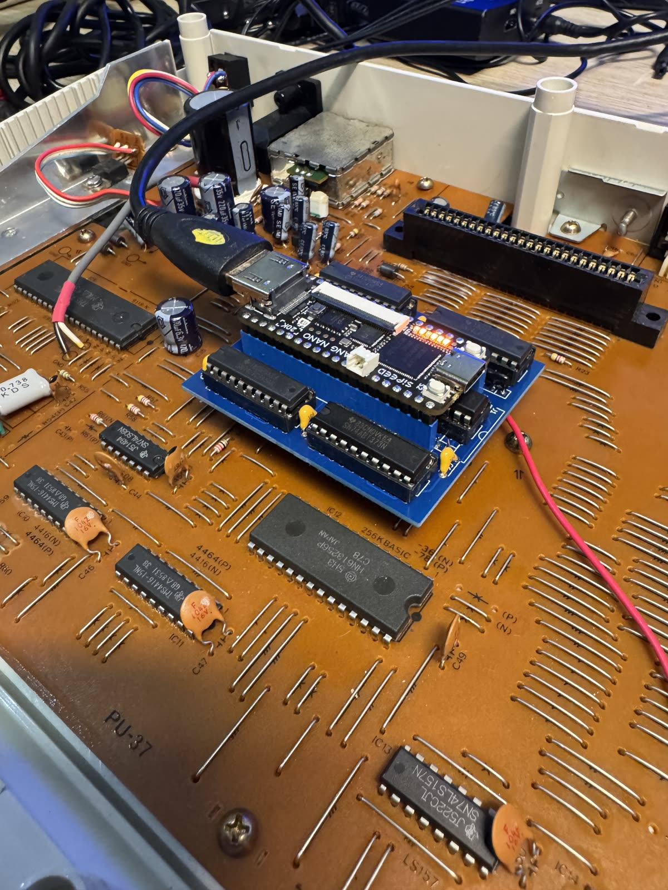

A special firmware for the **MSX Goa'uld** (Tang Nano 20K in the Z80 socket) that,
instead of booting the MSX, **tests the board** from the inside: BIOS, RAM, memory
mapper, VDP, VRAM, sprites, PPI, PSG, RTC and keyboard. The verdict comes out of the
**Goa'uld's HDMI**, so the board may have a dead BIOS, dead RAM and no video and you
still see what is wrong. Think of a Fluke 9010A in-circuit tester, built with what you
already have: the Goa'uld.

Born for two Japanese Sony HB-10s that would not boot; it works on **any MSX1 or MSX2**
(any slot and subslot, V9938/V9958 with 64/128 KB VRAM, memory mapper, RTC).

Derived from [jabadiagm/MSXgoauldSD_tn20k](https://github.com/jabadiagm/MSXgoauldSD_tn20k)
(the Goa'uld MSX2+ core: T80, HRA!'s V9958, SDRAM, flash loader). GPLv3.

The text on screen is in Spanish; every line is explained below.

## What you need

- A Goa'uld (Tang Nano 20K) plugged into the Z80 socket of the board under repair, and an HDMI monitor.
- Flash the Tang Nano with the Gowin programmer, exactly like a normal Goa'uld:
  - `GoauldDoctor_v1.0.fs` → **0x000000** (or load it into SRAM for one session).
  - The **Goa'uld v1.2 BIOS pack** → **0x200000** (the same one your Goa'uld already uses;
    it contains copyrighted BIOS ROMs and is not distributed here).
- The board has to power the Goa'uld: if the Goa'uld keeps resetting, measure the 5 V it gets.

No SD card, no USB keyboard, no WiFi: this build leaves them out on purpose.

## What you see on screen

### 1. Boot

The Goa'uld's MSX2+ logo (as always), then a progress line:

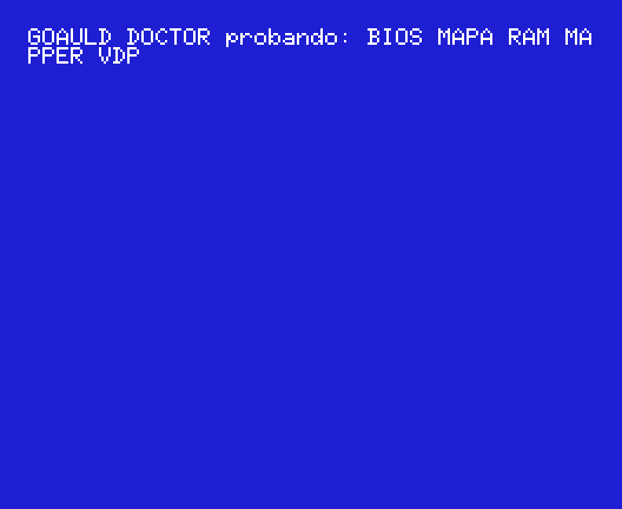

`probando` = testing. It takes from 10 s (MSX1) to ~40 s (MSX2 with 128 KB VRAM and a
mapper). While the VDP is under test the **board's own video output** shows colour
bars, text and sprites: with its monitor connected you can see whether the video
stage works.

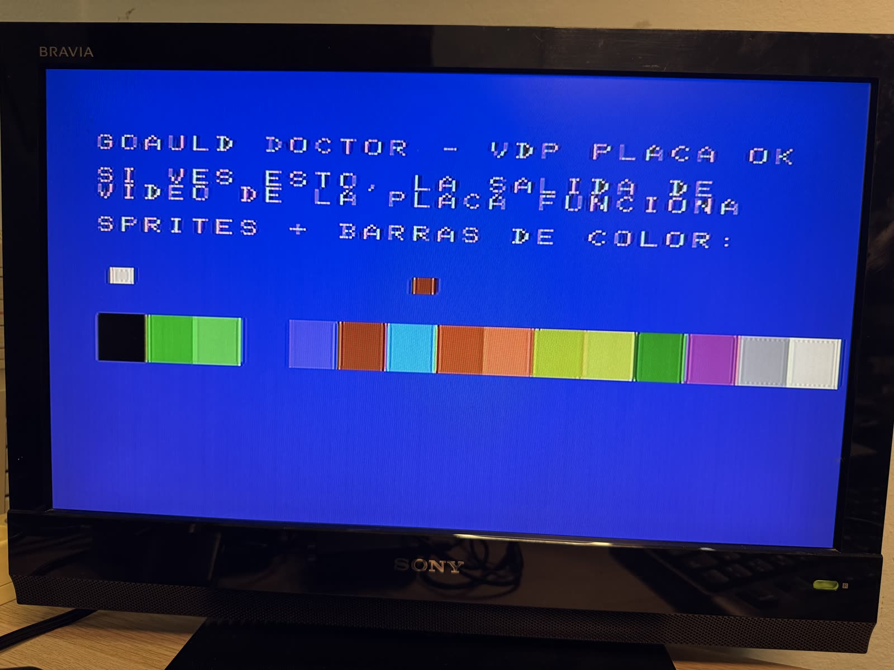

### 2. The summary

Real example: a healthy Sony HB-10.

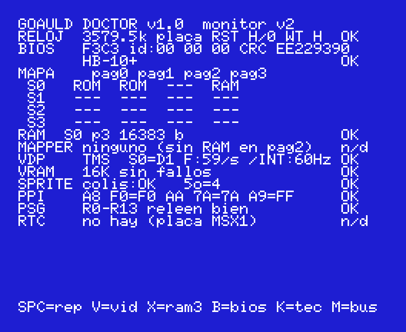

Every row ends in **OK**, **MAL** (bad) or **n/d** (not applicable). Read it top to
bottom: the first MAL row is usually the fault.

| Row | What it tests | What it says |
|---|---|---|
| **RELOJ** (clock) | The 3.58 MHz clock the board feeds the Z80 (it comes from the VDP). | `3579.6k placa` = measured kHz and source (`placa` = board). `INT!` = no clock arrives and the Goa'uld runs on its own. `RST H/0` = /RESET level and edges since power-up. `WT H` = /WAIT level (`/WAIT pegado` = stuck /WAIT, released by the Goa'uld). |
| **BIOS** | Reads the board's ROM (0000-7FFF) through the bus. | The first two bytes (`F3C3` = DI;JP), the id bytes 002B-2D, the CRC32 and the machine name when recognised (95 MSX1/MSX2 ROMs). `BIOS muda` = mute (all FF). A data line that never moved is reported below in the hints. |
| **MAPA** (map) | Every slot (and subslot when expanded) per page. | `ROM` reads something, `RAM` can be written, `---` empty, `own` the page the Doctor itself lives in (emulator only). |
| **RAM** | Every RAM block of the map: March C-, walking bits, address lines, retention. | `S0 p3 16383 b OK`, or `FALLO @C123 e=00 g=01 f2` = failure at address, expected, got, phase. Pages of one slot are grouped: `p0-p2 48 KB`. |
| **MAPPER** | Memory mapper (ports FC-FF) in every slot with RAM in page 2. | `8 seg 128K regs ok` (8 segments, registers ok), `sin mapper (RAM plana)` = plain RAM, or `seg 5 @9234 e=92 g=00` / `FD s2 @4000 …` when a segment or a register fails. |
| **VDP** | The board's video chip. | Type (`TMS`, `9938`, `9958`), status register, frames per second, /INT rate with interrupts enabled. `VDP mudo` = no answer. |
| **VRAM** | All the VRAM (16/64/128 KB) through ports 98/99. | `16K sin fallos` = no failures, or `1 fallos bits:5A / 1o @b5:0234 e=5A g=00 f6`: count, bad bits, first failure (bank:address), phase. |
| **CMD** | V9938/V9958 only: the command engine (HMMV + HMMM). | `verificados` = verified, or `motor colgado` = engine hung. |
| **SPRITE** | Sprite collision and 5th-sprite flag, really rendered. | `colis:OK 5o=4`. |
| **PPI** | The board's 8255. | Written vs. read back on A8 and AA, and what A9 reads (keyboard column). |
| **PSG** | The board's AY-3-8910. | `R0-R13 releen bien` = read back fine, or the list of failing registers. |
| **RTC** | MSX2 only: the RP5C01 (B4/B5). | `RP5C01 seg 32>34 RAM26 ok` (seconds advance, its 26 RAM nibbles hold), `PARADO: 32kHz/pila` = stopped (crystal/battery), `no responde` = no answer. MSX1: `no hay (placa MSX1)` = none. |

Below, the **hints** (`>` lines): what the Doctor deduces from the whole picture.

```
> Sin reloj Z80: VDP, cristal 10.7MHz o 5V       no Z80 clock: VDP, 10.7 MHz crystal or 5 V
> BIOS muda y VDP mudo: 5V, reset, /SLTSL        mute BIOS and mute VDP: 5 V, reset, /SLTSL
> BUS DATOS pegado (todo falla por eso): D1=1    data bus stuck (everything fails because of it)
> VRAM: nibble D0-D3 64-128K                     which VRAM chip: nibble / 64 KB half
> pag3 lee y no escribe: VCC/GND RAM, /W         page 3 reads but does not write: RAM VCC/GND, /W
> RAM y VRAM fallan: alimentacion DRAM?          RAM and VRAM both fail: DRAM supply?
> Teclado placa: pegada f/b 8/0                  board keyboard: stuck key row/bit
> Teclado placa: 26 cambios/s, ignorado          board keyboard: 26 changes/s by itself, ignored
```

Real example: the second HB-10, whose RAM reads but does not write (4416 DRAMs):

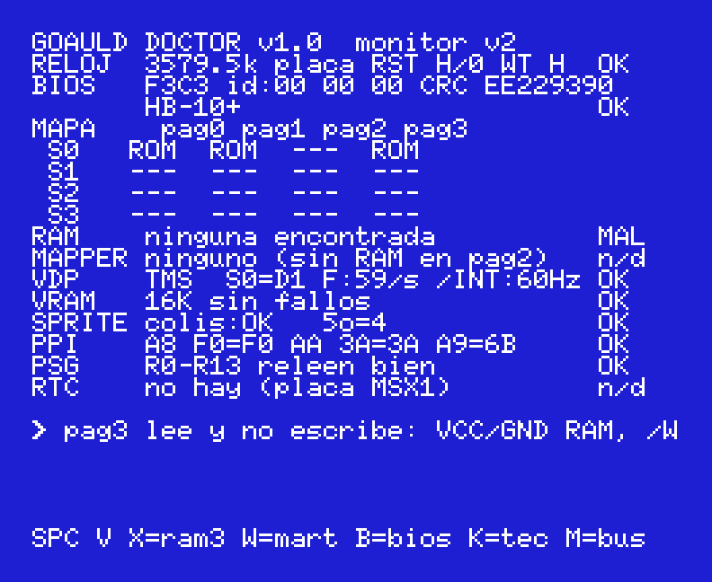

An MSX2 (Philips NMS 8250, in openMSX):

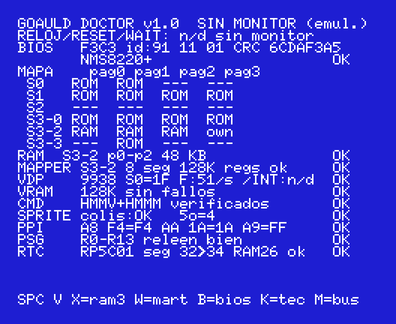

### 3. Keys

The Doctor scans the board's keyboard matrix itself (through the PPI) and only reacts
to a key that **goes from released to pressed** after half a second of quiet: a stuck
or intermittent membrane cannot drive it, and it is reported in the hints.

| Key | Screen |
|---|---|
| **SPC** | Runs the whole diagnostic again. |
| **V** | Test patterns on the **board's** video output: `1` the Doctor frame (text + bars), `2` full-screen colour bars, `3` full white, `4` black (sync only); `ESC` returns and the pattern stays. For the video stage and the AV/RF connector (TMS COMVID, pin 36: ~1 Vpp). |
| **X** | Page 3 (C000 and E000) raw: two consecutive reads and a third one after writing 00..FF. `leo1 != leo2` = floating bus; if the third read equals the others, the RAM does not write. |
| **B** | Hex dump of the first bytes of the board's BIOS + CRC. |
| **K** | Live keyboard matrix of the board (11 rows × 8 bits, `X` = pressed); the CAPS LED blinks. `ESC` returns. |
| **T** | Self-test of the stackless RAM routine on the Goa'uld's own page 2. |
| **M** | The original bus-monitor panel: data and address lines that never moved, /INT, /WAIT, counters. `ESC` returns. |

Screen `K` (SPC pressed):

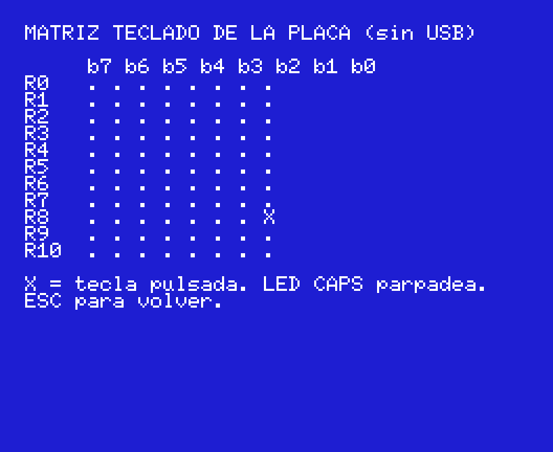

Screen `X` (the healthy HB-10: page 3 holds the C3 left by the retention test and takes the 00..FF):

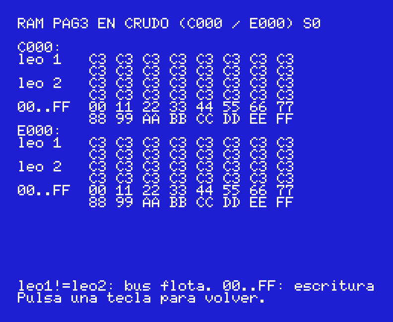

Screen `M`:

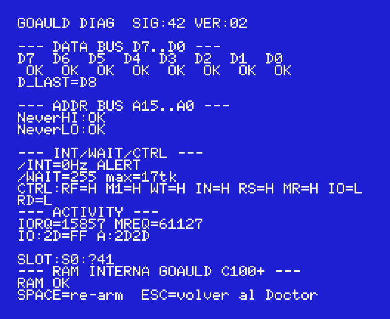

Screen `B`:

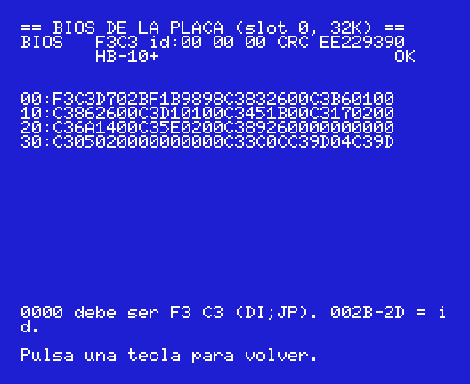

## Real repairs

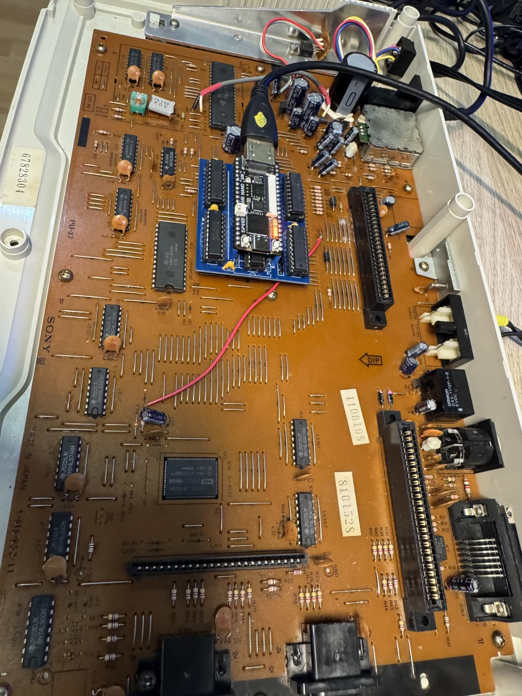

- **HB-10 #1**: the Doctor passed everything — BIOS, RAM, VDP, VRAM, sprites, PSG — and
  still there was no picture. When everything is fine from the socket, what is left is what
  the Z80 cannot see: the video output stage. A cut trace in the video out.
- **HB-10 #2**: `BUS DATOS pegado: D1=1` with everything failing → the D1 trace was cut.
  Bridged, the board booted again; what remained was `pag3 lee y no escribe` → the 4416s.

## Building

```bash
cd diag
sjasmplus --lst=diag.lst --sym=diag.sym src/diag.asm   # -> DIAG.ROM (16 KB)
python tools/split_rom_hex.py                          # -> ../fpga/msx_debug/diag_rom_0..7.hex
cd ../fpga
gw_sh build_diag.tcl                                   # Gowin 1.9.9 -> impl/pnr/project.fs
```

Try it without hardware, in openMSX: `openmsx -machine Sony_HB-10 -carta diag/DIAG.ROM`
(without the bus monitor the first row says `n/d sin monitor`; the rest is the same).

The screens in `docs/img` are exact transcriptions drawn with the MSX font
(`docs/tools/make_screens.py`); the photos are of the two real HB-10s.

How it works inside (bus-monitor registers, stackless tests, what the FPGA build leaves
out, how it was validated) is in [docs/notas-tecnicas.md](docs/notas-tecnicas.md).
